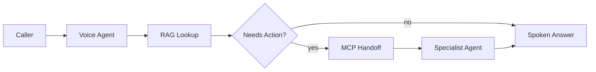

# ☎️ Switchboard — Voice-Enabled Multi-Agent Support Desk

  

> 💡 **A caller reaches an agent that can actually do something, not just recite an FAQ.**



---

**AI Expert Core Tracks — Track 1 of 6: AI Builder.** A self-hosted n8n support desk that takes a voice call, retrieves an answer via RAG, and escalates through a multi-agent workflow with MCP tools — built while working through *AI Builder: Create Agents, Voice Agents & Automations in n8n* (Weeks 1–3: workflows → voice + RAG → multi-agent + MCP).

## 🧩 Sub-projects
- **`week1-workflows/`** — core n8n automation workflows in n8n Cloud, exported and documented
- **`week2-voice-rag/`** — a voice agent (speech-in/out) backed by a RAG knowledge base
- **`week3-multi-agent-mcp/`** — multi-agent handoff (intake agent → specialist agent) connected through MCP

## 🚀 Capstone
A caller reaches a voice agent, which retrieves an answer via RAG; if the question needs a real action (check an order, open a ticket), it hands off through MCP to a specialist agent — all orchestrated in a single, self-hosted n8n instance.

## ⚡ Quickstart
```bash
git clone <your-fork-url> && cd switchboard
cp .env.example .env
./scripts/setup.sh
./scripts/dev.sh    # boots the local n8n instance
```

## 🗺️ Roadmap
- [ ] Week 1 workflows exported + documented
- [ ] Voice agent + RAG knowledge base working end-to-end
- [ ] Multi-agent handoff via MCP
- [ ] Capstone: full call → answer/action → spoken response, on a self-hosted instance
- [ ] Demo recording (real or simulated call)

## 📈 At 10x Scale, I'd
Move the RAG index off the n8n workflow into its own service so it can be updated independently, add call-volume-based autoscaling for the voice agent, and add a fallback-to-human path when agent confidence is low.

## 🔍 Originality vs. the Course
The course teaches workflows, voice+RAG, and multi-agent+MCP as separate weekly arcs; this repo integrates all three into one working support-desk capstone the course doesn't assemble as a single artifact.

## 📄 License
MIT – see `LICENSE`.
